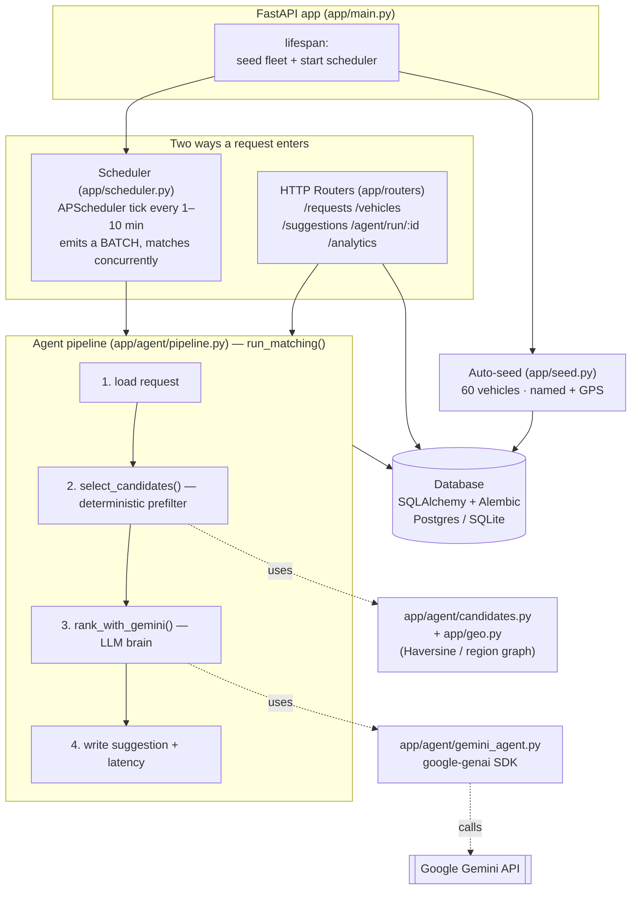
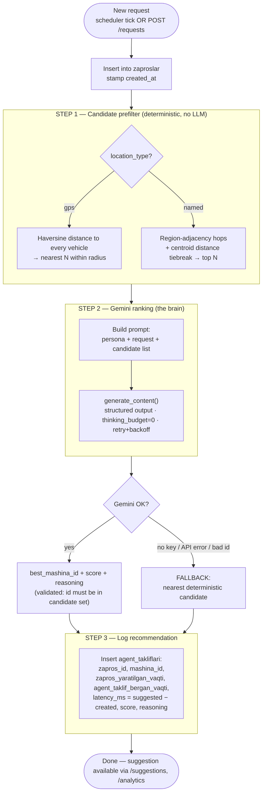
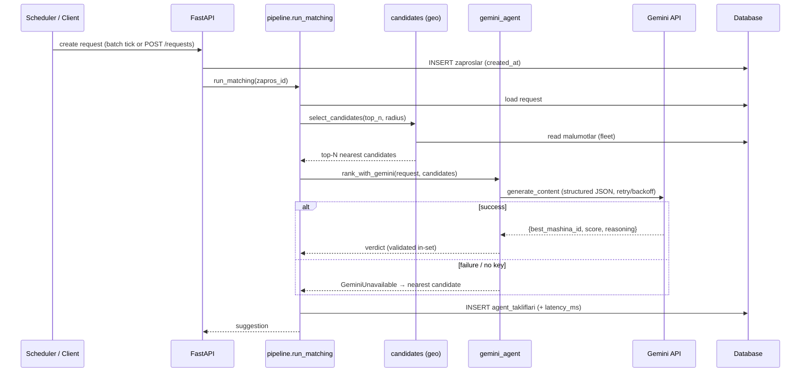
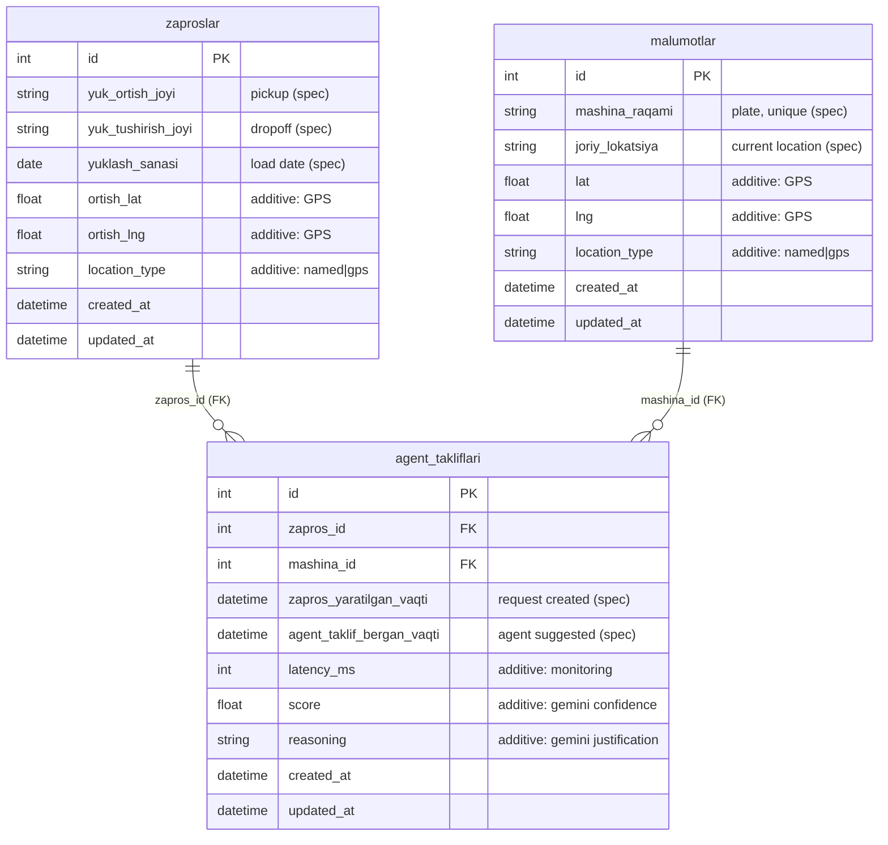

# Architecture

AI agent that matches auto-generated cargo transport **requests** to the best
available **vehicle**, using **Google Gemini** as the decision-making brain and
logging every recommendation with its latency for monitoring.

- **Stack:** FastAPI · SQLAlchemy 2.0 · Alembic · APScheduler · `google-genai` · PostgreSQL/SQLite
- **Core idea:** a cheap deterministic prefilter narrows the fleet → Gemini ranks/justifies among
  *real* candidates → result + latency is logged. If Gemini is unavailable, it falls back to the
  nearest candidate so the system never stalls.

---

## 1. Component architecture



---

## 2. Matching flow (per request)



---

## 3. Request lifecycle (sequence)



---

## 4. Data model



> Table & column names are kept verbatim in Uzbek to match the assignment spec.
> Columns marked **additive** are extras enabling GPS matching and latency/quality analytics.

---

## 5. Directory map → responsibility

```
app/
├── main.py             FastAPI app; lifespan seeds fleet + starts scheduler
├── config.py           pydantic-settings (DB, Gemini key/model/thinking, concurrency…)
├── database.py         SQLAlchemy engine, SessionLocal, get_db dependency
├── models.py           3 ORM models (the tables above)
├── schemas.py          Pydantic I/O — English JSON ↔ Uzbek columns via aliases
├── geo.py              Uzbekistan regions, centroids, adjacency graph, Haversine
├── seed.py             sample fleet generator (idempotent)
├── scheduler.py        APScheduler: batch generator + concurrent matching
├── agent/
│   ├── candidates.py   STEP 1 — deterministic prefilter
│   ├── gemini_agent.py STEP 2 — Gemini ranking + retry + fallback signal
│   └── pipeline.py     orchestrates STEP 1→2→3 (run_matching)
└── routers/
    ├── zaproslar.py    POST/GET /requests  (POST → background match)
    ├── malumotlar.py   POST/GET /vehicles
    ├── takliflari.py   GET /suggestions, POST /agent/run/{id}
    └── analytics.py    GET /analytics (latency avg/p95, match rate, gemini vs fallback)

alembic/versions/       001 zaproslar · 002 malumotlar · 003 agent_takliflari
tests/                  candidates · pipeline · gemini retry · API integration (14 tests)
Dockerfile · docker-compose.yml   one-command app + Postgres
```

---

## 6. Key design decisions

1. **Deterministic prefilter + LLM ranking (hybrid).** Cheap geo math narrows the fleet to ~10
   grounded candidates; Gemini only *ranks and justifies* among real vehicles. This keeps the
   prompt small/cheap, prevents hallucinated vehicles, and still makes the LLM the decision-maker.

2. **Resilience + observability.** Every request always produces a logged suggestion with a
   measured `latency_ms` — via Gemini or the deterministic fallback — so the system never stalls
   and the "agent efficiency monitoring" requirement is satisfied with real data.

3. **Spec fidelity with a clean API.** DB tables/columns stay in Uzbek exactly as specified;
   the HTTP API is English, mapped through Pydantic aliases.

4. **Throughput vs. cadence.** A uniform 1–10 min interval averages 5.5 min → ~262 requests/day,
   *below* the required 400. The generator emits a small **batch per tick** (default 2) →
   ~524/day, satisfying ≥400/day while keeping the 1–10 min cadence. Batches are matched
   **concurrently** (one DB session per match) so wall-clock ≈ a single Gemini call.

5. **Latency-aware Gemini usage.** `thinking_budget=0` on `gemini-2.5-flash` (~3.0s → ~1.5s/call,
   measured) plus retry-with-backoff before falling back.
```
